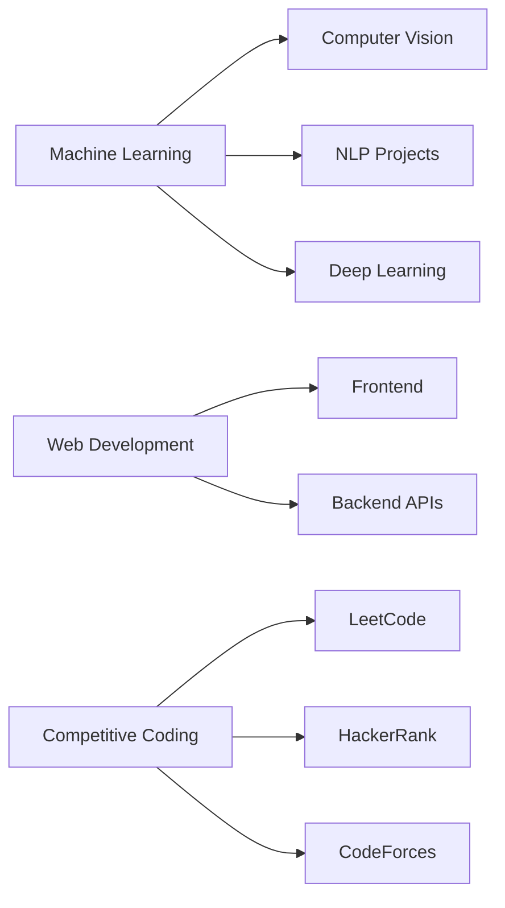

<div align="center">

# 🚀 NAVEEN RONDLA

### Machine Learning Engineer | AI Innovator | Full-Stack Developer


[](https://naveen-rondla-2005.github.io/Portfolio/)
[](https://drive.google.com/file/d/16VlVl6tP8Uf4nB1ZxDERS1OUQWLYsZCw/view?usp=sharing)
[](mailto:naveenrondla@hotmail.com)


</div>

---

## 💫 About Me

```python
class MLEngineer:
    def __init__(self):
        self.name = "Naveen Rondla"
        self.role = "Machine Learning Engineer"
        self.education = "B.Tech Student"
        self.location = "India 🇮🇳"
        self.expertise = ["Computer Vision", "NLP", "Deep Learning"]
        
    def get_skills(self):
        return {
            "languages": ["Python", "C", "C++", "Java", "JavaScript"],
            "ml_frameworks": ["PyTorch", "TensorFlow", "Scikit-learn"],
            "web_frameworks": ["Flask", "Django", "Streamlit"],
            "databases": ["MongoDB", "PostgreSQL", "MySQL"],
            "tools": ["Git", "AWS", "Firebase", "OpenCV"]
        }
    
    def current_focus(self):
        return "Building innovative AI solutions and interactive ML applications"

me = MLEngineer()
```

<div align="center">

### 🎯 Core Competencies

</div>

<table>
<tr>
<td width="50%" valign="top">

#### 🤖 Machine Learning
- **Computer Vision** - Image Processing & Recognition
- **Natural Language Processing** - Text Analysis & Generation
- **Deep Learning** - Neural Network Architectures
- **Model Deployment** - Production-Ready Solutions

</td>
<td width="50%" valign="top">

#### 💻 Development
- **Full-Stack Development** - End-to-End Solutions
- **Interactive Applications** - Streamlit & Web Apps
- **Database Management** - SQL & NoSQL
- **Cloud Services** - AWS & Firebase

</td>
</tr>
</table>

---

## 🛠️ Technology Arsenal

<div align="center">

### Languages & Frameworks


### ML/AI Stack


### Development Tools


</div>

---

## 📊 GitHub Analytics

<div align="center">

<table>
<tr>
<td>

### 📈 Quick Stats

```text
👨‍💻 Total Commits (2024): 500+
🔥 Current Streak: Active
⭐ Total Stars Earned: 50+
🔀 Total PRs: 30+
🐛 Total Issues: 20+
👥 Followers: Growing
```

</td>
<td>

### 💻 Top Languages

```text
Python      ████████████░░  75%
JavaScript  ████████░░░░░░  50%
C++         ██████░░░░░░░░  40%
HTML/CSS    ████░░░░░░░░░░  30%
Java        ███░░░░░░░░░░░  25%
```

</td>
</tr>
</table>

### 🏆 Achievements & Milestones

<div align="center">

| 🎯 Milestone | ✅ Status | 📅 Achievement |
|:------------|:---------|:--------------|
| **100 Commits** | Completed | Expert Contributor |
| **First Repository** | Completed | Quick Starter |
| **50+ Stars** | Completed | Rising Star |
| **Active Contributor** | Ongoing | Consistent Coder |
| **Open Source** | Active | Community Builder |
| **ML Projects** | 10+ Projects | AI Specialist |

</div>

<br>

### 📊 Contribution Overview



### 🎨 Project Highlights

<table>
<tr>
<td align="center" width="33%">

#### 🤖 ML Projects
**Computer Vision**
Image Classification
Object Detection
Face Recognition

</td>
<td align="center" width="33%">

#### 🌐 Web Apps
**Full Stack**
Interactive Dashboards
ML Deployments
Streamlit Apps

</td>
<td align="center" width="33%">

#### 📊 Data Science
**Analytics**
Data Visualization
Predictive Models
Statistical Analysis

</td>
</tr>
</table>

</div>

---

## 🌐 Connect With Me

<div align="center">

[](https://linkedin.com/in/naveen-rondla-231611297)
[](https://kaggle.com/nrondla)
[](https://www.leetcode.com/naveenrondla)
[](https://www.hackerrank.com/naveenrondla)
[](https://auth.geeksforgeeks.org/user/user_37gkqxy42g8)
[](https://www.hackerearth.com/@naveenrondla)

[](https://instagram.com/nrondla)
[](https://fb.com/naveen.rondla.52)

</div>

---

<div align="center">

### 💭 Developer Quote


### 📈 Contribution Activity

<picture>
  <source media="(prefers-color-scheme: dark)" srcset="https://raw.githubusercontent.com/naveen-rondla-2005/naveen-rondla-2005/output/github-contribution-grid-snake-dark.svg">
  <source media="(prefers-color-scheme: light)" srcset="https://raw.githubusercontent.com/naveen-rondla-2005/naveen-rondla-2005/output/github-contribution-grid-snake.svg">
  
</picture>

*Note: Snake animation requires GitHub Actions setup. See below for instructions.*

---


**✨ "Building the future, one algorithm at a time" ✨**


</div>
